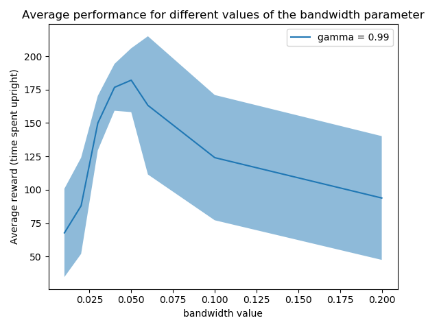

# Kernel-Based Linear Program
This codebase provides an implementation of a Kernel-Based Linear Program for solving MDPs. This work is based on "Kernel-Based Reinforcement Learning" Ormoneit and Sen (2002) (https://link.springer.com/content/pdf/10.1023/A:1017928328829.pdf) and also provides an implementation of their approximate value iteration algorithm. 

## Requirements
* [CVXPY](https://www.cvxpy.org/)
* [sklearn](https://scikit-learn.org/stable/)
* [gym](https://gym.openai.com/)

## Running experiments.
Example.ipynb is an example jupyter notebook demonstrating functionality.

## Sample experimental results.

Both the Kernel-Based Linear Program and Kernel-based value iteration algorithms where run on OpenAI's [Cartpole](https://gym.openai.com/envs/CartPole-v0/) environment. This environment has a continuous state space and 2 discrete actions (left and right). It is considered solved when the reward reaches 200.

